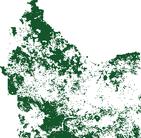
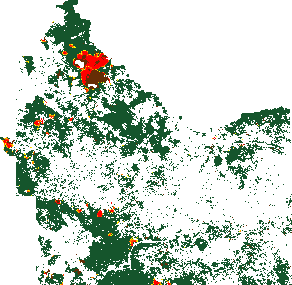
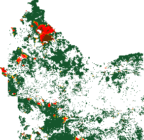
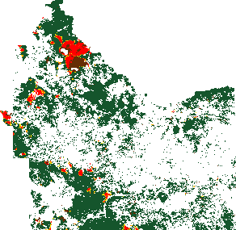
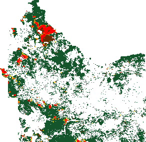

!SLIDE boundary-map
.notes indonesia

!SLIDE boundary-map
.notes indonesia

!SLIDE forma-slide
.notes forma output for kalimantan
# January #
## 2000 ##

<h2 style="position:absolute; top:415px; left:35px; color:#808080; font-size:20px">Attributes</h2>

<h2 style="position:absolute; top:449px; left:85px; color:#000000; font-size:15px">VCF > 25</h2>

!SLIDE forma-slide
.notes forma output for kalimantan
## 2000 - 2005 ##

<h2 style="position:absolute; top:415px; left:35px; color:#808080; font-size:20px">Attributes</h2>

<h2 style="position:absolute; top:449px; left:85px; color:#000000; font-size:15px">VCF > 25</h2>

<h2 style="position:absolute; top:491px; left:85px; color:#000000; font-size:15px">FCLH 2005</h2>

!SLIDE forma-slide
.notes forma output for riau
# January #
## 2006 ##

<h2 style="position:absolute; top:530px; left:35px; color:#808080; font-size:20px">Signal Strength</h2>

<h2 style="position:absolute; top:562px; left:85px; color:#000000; font-size:15px">50%-60%</h2>
<h2 style="position:absolute; top:583px; left:85px; color:#000000; font-size:15px">60%-70%</h2>
<h2 style="position:absolute; top:604px; left:85px; color:#000000; font-size:15px">70%-80%</h2>
<h2 style="position:absolute; top:625px; left:85px; color:#000000; font-size:15px">80%-90%</h2>
<h2 style="position:absolute; top:646px; left:85px; color:#000000; font-size:15px">90%-100%</h2>

<h2 style="position:absolute; top:415px; left:35px; color:#808080; font-size:20px">Attributes</h2>

<h2 style="position:absolute; top:449px; left:85px; color:#000000; font-size:15px">VCF > 25</h2>

<h2 style="position:absolute; top:491px; left:85px; color:#000000; font-size:15px">FCLH 2005</h2>

!SLIDE forma-slide
.notes forma output for riau
# February #
## 2006 ##

<h2 style="position:absolute; top:530px; left:35px; color:#808080; font-size:20px">Signal Strength</h2>

<h2 style="position:absolute; top:562px; left:85px; color:#000000; font-size:15px">50%-60%</h2>
<h2 style="position:absolute; top:583px; left:85px; color:#000000; font-size:15px">60%-70%</h2>
<h2 style="position:absolute; top:604px; left:85px; color:#000000; font-size:15px">70%-80%</h2>
<h2 style="position:absolute; top:625px; left:85px; color:#000000; font-size:15px">80%-90%</h2>
<h2 style="position:absolute; top:646px; left:85px; color:#000000; font-size:15px">90%-100%</h2>

<h2 style="position:absolute; top:415px; left:35px; color:#808080; font-size:20px">Attributes</h2>

<h2 style="position:absolute; top:449px; left:85px; color:#000000; font-size:15px">VCF > 25</h2>

<h2 style="position:absolute; top:491px; left:85px; color:#000000; font-size:15px">FCLH 2005</h2>

!SLIDE forma-slide
.notes forma output for riau
# March #
## 2006 ##

<h2 style="position:absolute; top:530px; left:35px; color:#808080; font-size:20px">Signal Strength</h2>

<h2 style="position:absolute; top:562px; left:85px; color:#000000; font-size:15px">50%-60%</h2>
<h2 style="position:absolute; top:583px; left:85px; color:#000000; font-size:15px">60%-70%</h2>
<h2 style="position:absolute; top:604px; left:85px; color:#000000; font-size:15px">70%-80%</h2>
<h2 style="position:absolute; top:625px; left:85px; color:#000000; font-size:15px">80%-90%</h2>
<h2 style="position:absolute; top:646px; left:85px; color:#000000; font-size:15px">90%-100%</h2>

<h2 style="position:absolute; top:415px; left:35px; color:#808080; font-size:20px">Attributes</h2>

<h2 style="position:absolute; top:449px; left:85px; color:#000000; font-size:15px">VCF > 25</h2>

<h2 style="position:absolute; top:491px; left:85px; color:#000000; font-size:15px">FCLH 2005</h2>

!SLIDE forma-slide
.notes forma output for riau
# April #
## 2006 ##

<h2 style="position:absolute; top:530px; left:35px; color:#808080; font-size:20px">Signal Strength</h2>

<h2 style="position:absolute; top:562px; left:85px; color:#000000; font-size:15px">50%-60%</h2>
<h2 style="position:absolute; top:583px; left:85px; color:#000000; font-size:15px">60%-70%</h2>
<h2 style="position:absolute; top:604px; left:85px; color:#000000; font-size:15px">70%-80%</h2>
<h2 style="position:absolute; top:625px; left:85px; color:#000000; font-size:15px">80%-90%</h2>
<h2 style="position:absolute; top:646px; left:85px; color:#000000; font-size:15px">90%-100%</h2>

<h2 style="position:absolute; top:415px; left:35px; color:#808080; font-size:20px">Attributes</h2>

<h2 style="position:absolute; top:449px; left:85px; color:#000000; font-size:15px">VCF > 25</h2>

<h2 style="position:absolute; top:491px; left:85px; color:#000000; font-size:15px">FCLH 2005</h2>

!SLIDE forma-slide
.notes forma output for riau
# May #
## 2006 ##

<h2 style="position:absolute; top:530px; left:35px; color:#808080; font-size:20px">Signal Strength</h2>

<h2 style="position:absolute; top:562px; left:85px; color:#000000; font-size:15px">50%-60%</h2>
<h2 style="position:absolute; top:583px; left:85px; color:#000000; font-size:15px">60%-70%</h2>
<h2 style="position:absolute; top:604px; left:85px; color:#000000; font-size:15px">70%-80%</h2>
<h2 style="position:absolute; top:625px; left:85px; color:#000000; font-size:15px">80%-90%</h2>
<h2 style="position:absolute; top:646px; left:85px; color:#000000; font-size:15px">90%-100%</h2>

<h2 style="position:absolute; top:415px; left:35px; color:#808080; font-size:20px">Attributes</h2>

<h2 style="position:absolute; top:449px; left:85px; color:#000000; font-size:15px">VCF > 25</h2>

<h2 style="position:absolute; top:491px; left:85px; color:#000000; font-size:15px">FCLH 2005</h2>

!SLIDE forma-slide
.notes forma output for riau
# June #
## 2006 ##

<h2 style="position:absolute; top:530px; left:35px; color:#808080; font-size:20px">Signal Strength</h2>

<h2 style="position:absolute; top:562px; left:85px; color:#000000; font-size:15px">50%-60%</h2>
<h2 style="position:absolute; top:583px; left:85px; color:#000000; font-size:15px">60%-70%</h2>
<h2 style="position:absolute; top:604px; left:85px; color:#000000; font-size:15px">70%-80%</h2>
<h2 style="position:absolute; top:625px; left:85px; color:#000000; font-size:15px">80%-90%</h2>
<h2 style="position:absolute; top:646px; left:85px; color:#000000; font-size:15px">90%-100%</h2>

<h2 style="position:absolute; top:415px; left:35px; color:#808080; font-size:20px">Attributes</h2>

<h2 style="position:absolute; top:449px; left:85px; color:#000000; font-size:15px">VCF > 25</h2>

<h2 style="position:absolute; top:491px; left:85px; color:#000000; font-size:15px">FCLH 2005</h2>

!SLIDE forma-slide
.notes forma output for riau
# July #
## 2006 ##

<h2 style="position:absolute; top:530px; left:35px; color:#808080; font-size:20px">Signal Strength</h2>

<h2 style="position:absolute; top:562px; left:85px; color:#000000; font-size:15px">50%-60%</h2>
<h2 style="position:absolute; top:583px; left:85px; color:#000000; font-size:15px">60%-70%</h2>
<h2 style="position:absolute; top:604px; left:85px; color:#000000; font-size:15px">70%-80%</h2>
<h2 style="position:absolute; top:625px; left:85px; color:#000000; font-size:15px">80%-90%</h2>
<h2 style="position:absolute; top:646px; left:85px; color:#000000; font-size:15px">90%-100%</h2>

<h2 style="position:absolute; top:415px; left:35px; color:#808080; font-size:20px">Attributes</h2>

<h2 style="position:absolute; top:449px; left:85px; color:#000000; font-size:15px">VCF > 25</h2>

<h2 style="position:absolute; top:491px; left:85px; color:#000000; font-size:15px">FCLH 2005</h2>

!SLIDE forma-slide
.notes forma output for riau
# August #
## 2006 ##

<h2 style="position:absolute; top:530px; left:35px; color:#808080; font-size:20px">Signal Strength</h2>

<h2 style="position:absolute; top:562px; left:85px; color:#000000; font-size:15px">50%-60%</h2>
<h2 style="position:absolute; top:583px; left:85px; color:#000000; font-size:15px">60%-70%</h2>
<h2 style="position:absolute; top:604px; left:85px; color:#000000; font-size:15px">70%-80%</h2>
<h2 style="position:absolute; top:625px; left:85px; color:#000000; font-size:15px">80%-90%</h2>
<h2 style="position:absolute; top:646px; left:85px; color:#000000; font-size:15px">90%-100%</h2>

<h2 style="position:absolute; top:415px; left:35px; color:#808080; font-size:20px">Attributes</h2>

<h2 style="position:absolute; top:449px; left:85px; color:#000000; font-size:15px">VCF > 25</h2>

<h2 style="position:absolute; top:491px; left:85px; color:#000000; font-size:15px">FCLH 2005</h2>

!SLIDE forma-slide
.notes forma output for riau
# September #
## 2006 ##

<h2 style="position:absolute; top:530px; left:35px; color:#808080; font-size:20px">Signal Strength</h2>

<h2 style="position:absolute; top:562px; left:85px; color:#000000; font-size:15px">50%-60%</h2>
<h2 style="position:absolute; top:583px; left:85px; color:#000000; font-size:15px">60%-70%</h2>
<h2 style="position:absolute; top:604px; left:85px; color:#000000; font-size:15px">70%-80%</h2>
<h2 style="position:absolute; top:625px; left:85px; color:#000000; font-size:15px">80%-90%</h2>
<h2 style="position:absolute; top:646px; left:85px; color:#000000; font-size:15px">90%-100%</h2>

<h2 style="position:absolute; top:415px; left:35px; color:#808080; font-size:20px">Attributes</h2>

<h2 style="position:absolute; top:449px; left:85px; color:#000000; font-size:15px">VCF > 25</h2>

<h2 style="position:absolute; top:491px; left:85px; color:#000000; font-size:15px">FCLH 2005</h2>

!SLIDE forma-slide
.notes forma output for riau
# October #
## 2006 ##

<h2 style="position:absolute; top:530px; left:35px; color:#808080; font-size:20px">Signal Strength</h2>

<h2 style="position:absolute; top:562px; left:85px; color:#000000; font-size:15px">50%-60%</h2>
<h2 style="position:absolute; top:583px; left:85px; color:#000000; font-size:15px">60%-70%</h2>
<h2 style="position:absolute; top:604px; left:85px; color:#000000; font-size:15px">70%-80%</h2>
<h2 style="position:absolute; top:625px; left:85px; color:#000000; font-size:15px">80%-90%</h2>
<h2 style="position:absolute; top:646px; left:85px; color:#000000; font-size:15px">90%-100%</h2>

<h2 style="position:absolute; top:415px; left:35px; color:#808080; font-size:20px">Attributes</h2>

<h2 style="position:absolute; top:449px; left:85px; color:#000000; font-size:15px">VCF > 25</h2>

<h2 style="position:absolute; top:491px; left:85px; color:#000000; font-size:15px">FCLH 2005</h2>

!SLIDE forma-slide
.notes forma output for riau
# November #
## 2006 ##

<h2 style="position:absolute; top:530px; left:35px; color:#808080; font-size:20px">Signal Strength</h2>

<h2 style="position:absolute; top:562px; left:85px; color:#000000; font-size:15px">50%-60%</h2>
<h2 style="position:absolute; top:583px; left:85px; color:#000000; font-size:15px">60%-70%</h2>
<h2 style="position:absolute; top:604px; left:85px; color:#000000; font-size:15px">70%-80%</h2>
<h2 style="position:absolute; top:625px; left:85px; color:#000000; font-size:15px">80%-90%</h2>
<h2 style="position:absolute; top:646px; left:85px; color:#000000; font-size:15px">90%-100%</h2>

<h2 style="position:absolute; top:415px; left:35px; color:#808080; font-size:20px">Attributes</h2>

<h2 style="position:absolute; top:449px; left:85px; color:#000000; font-size:15px">VCF > 25</h2>

<h2 style="position:absolute; top:491px; left:85px; color:#000000; font-size:15px">FCLH 2005</h2>

!SLIDE forma-slide
.notes forma output for riau
# December #
## 2006 ##

<h2 style="position:absolute; top:530px; left:35px; color:#808080; font-size:20px">Signal Strength</h2>

<h2 style="position:absolute; top:562px; left:85px; color:#000000; font-size:15px">50%-60%</h2>
<h2 style="position:absolute; top:583px; left:85px; color:#000000; font-size:15px">60%-70%</h2>
<h2 style="position:absolute; top:604px; left:85px; color:#000000; font-size:15px">70%-80%</h2>
<h2 style="position:absolute; top:625px; left:85px; color:#000000; font-size:15px">80%-90%</h2>
<h2 style="position:absolute; top:646px; left:85px; color:#000000; font-size:15px">90%-100%</h2>

<h2 style="position:absolute; top:415px; left:35px; color:#808080; font-size:20px">Attributes</h2>

<h2 style="position:absolute; top:449px; left:85px; color:#000000; font-size:15px">VCF > 25</h2>

<h2 style="position:absolute; top:491px; left:85px; color:#000000; font-size:15px">FCLH 2005</h2>

!SLIDE forma-slide
.notes forma output for riau
# January #
## 2007 ##

<h2 style="position:absolute; top:530px; left:35px; color:#808080; font-size:20px">Signal Strength</h2>

<h2 style="position:absolute; top:562px; left:85px; color:#000000; font-size:15px">50%-60%</h2>
<h2 style="position:absolute; top:583px; left:85px; color:#000000; font-size:15px">60%-70%</h2>
<h2 style="position:absolute; top:604px; left:85px; color:#000000; font-size:15px">70%-80%</h2>
<h2 style="position:absolute; top:625px; left:85px; color:#000000; font-size:15px">80%-90%</h2>
<h2 style="position:absolute; top:646px; left:85px; color:#000000; font-size:15px">90%-100%</h2>

<h2 style="position:absolute; top:415px; left:35px; color:#808080; font-size:20px">Attributes</h2>

<h2 style="position:absolute; top:449px; left:85px; color:#000000; font-size:15px">VCF > 25</h2>

<h2 style="position:absolute; top:491px; left:85px; color:#000000; font-size:15px">FCLH 2005</h2>

!SLIDE forma-slide
.notes forma output for riau
# February #
## 2007 ##

<h2 style="position:absolute; top:530px; left:35px; color:#808080; font-size:20px">Signal Strength</h2>

<h2 style="position:absolute; top:562px; left:85px; color:#000000; font-size:15px">50%-60%</h2>
<h2 style="position:absolute; top:583px; left:85px; color:#000000; font-size:15px">60%-70%</h2>
<h2 style="position:absolute; top:604px; left:85px; color:#000000; font-size:15px">70%-80%</h2>
<h2 style="position:absolute; top:625px; left:85px; color:#000000; font-size:15px">80%-90%</h2>
<h2 style="position:absolute; top:646px; left:85px; color:#000000; font-size:15px">90%-100%</h2>

<h2 style="position:absolute; top:415px; left:35px; color:#808080; font-size:20px">Attributes</h2>

<h2 style="position:absolute; top:449px; left:85px; color:#000000; font-size:15px">VCF > 25</h2>

<h2 style="position:absolute; top:491px; left:85px; color:#000000; font-size:15px">FCLH 2005</h2>

!SLIDE forma-slide
.notes forma output for riau
# March #
## 2007 ##

<h2 style="position:absolute; top:530px; left:35px; color:#808080; font-size:20px">Signal Strength</h2>

<h2 style="position:absolute; top:562px; left:85px; color:#000000; font-size:15px">50%-60%</h2>
<h2 style="position:absolute; top:583px; left:85px; color:#000000; font-size:15px">60%-70%</h2>
<h2 style="position:absolute; top:604px; left:85px; color:#000000; font-size:15px">70%-80%</h2>
<h2 style="position:absolute; top:625px; left:85px; color:#000000; font-size:15px">80%-90%</h2>
<h2 style="position:absolute; top:646px; left:85px; color:#000000; font-size:15px">90%-100%</h2>

<h2 style="position:absolute; top:415px; left:35px; color:#808080; font-size:20px">Attributes</h2>

<h2 style="position:absolute; top:449px; left:85px; color:#000000; font-size:15px">VCF > 25</h2>

<h2 style="position:absolute; top:491px; left:85px; color:#000000; font-size:15px">FCLH 2005</h2>

!SLIDE forma-slide
.notes forma output for riau
# April #
## 2007 ##

<h2 style="position:absolute; top:530px; left:35px; color:#808080; font-size:20px">Signal Strength</h2>

<h2 style="position:absolute; top:562px; left:85px; color:#000000; font-size:15px">50%-60%</h2>
<h2 style="position:absolute; top:583px; left:85px; color:#000000; font-size:15px">60%-70%</h2>
<h2 style="position:absolute; top:604px; left:85px; color:#000000; font-size:15px">70%-80%</h2>
<h2 style="position:absolute; top:625px; left:85px; color:#000000; font-size:15px">80%-90%</h2>
<h2 style="position:absolute; top:646px; left:85px; color:#000000; font-size:15px">90%-100%</h2>

<h2 style="position:absolute; top:415px; left:35px; color:#808080; font-size:20px">Attributes</h2>

<h2 style="position:absolute; top:449px; left:85px; color:#000000; font-size:15px">VCF > 25</h2>

<h2 style="position:absolute; top:491px; left:85px; color:#000000; font-size:15px">FCLH 2005</h2>

!SLIDE forma-slide
.notes forma output for riau
# May #
## 2007 ##

<h2 style="position:absolute; top:530px; left:35px; color:#808080; font-size:20px">Signal Strength</h2>

<h2 style="position:absolute; top:562px; left:85px; color:#000000; font-size:15px">50%-60%</h2>
<h2 style="position:absolute; top:583px; left:85px; color:#000000; font-size:15px">60%-70%</h2>
<h2 style="position:absolute; top:604px; left:85px; color:#000000; font-size:15px">70%-80%</h2>
<h2 style="position:absolute; top:625px; left:85px; color:#000000; font-size:15px">80%-90%</h2>
<h2 style="position:absolute; top:646px; left:85px; color:#000000; font-size:15px">90%-100%</h2>

<h2 style="position:absolute; top:415px; left:35px; color:#808080; font-size:20px">Attributes</h2>

<h2 style="position:absolute; top:449px; left:85px; color:#000000; font-size:15px">VCF > 25</h2>

<h2 style="position:absolute; top:491px; left:85px; color:#000000; font-size:15px">FCLH 2005</h2>

!SLIDE forma-slide
.notes forma output for riau
# June #
## 2007 ##

<h2 style="position:absolute; top:530px; left:35px; color:#808080; font-size:20px">Signal Strength</h2>

<h2 style="position:absolute; top:562px; left:85px; color:#000000; font-size:15px">50%-60%</h2>
<h2 style="position:absolute; top:583px; left:85px; color:#000000; font-size:15px">60%-70%</h2>
<h2 style="position:absolute; top:604px; left:85px; color:#000000; font-size:15px">70%-80%</h2>
<h2 style="position:absolute; top:625px; left:85px; color:#000000; font-size:15px">80%-90%</h2>
<h2 style="position:absolute; top:646px; left:85px; color:#000000; font-size:15px">90%-100%</h2>

<h2 style="position:absolute; top:415px; left:35px; color:#808080; font-size:20px">Attributes</h2>

<h2 style="position:absolute; top:449px; left:85px; color:#000000; font-size:15px">VCF > 25</h2>

<h2 style="position:absolute; top:491px; left:85px; color:#000000; font-size:15px">FCLH 2005</h2>

!SLIDE forma-slide
.notes forma output for riau
# July #
## 2007 ##

<h2 style="position:absolute; top:530px; left:35px; color:#808080; font-size:20px">Signal Strength</h2>

<h2 style="position:absolute; top:562px; left:85px; color:#000000; font-size:15px">50%-60%</h2>
<h2 style="position:absolute; top:583px; left:85px; color:#000000; font-size:15px">60%-70%</h2>
<h2 style="position:absolute; top:604px; left:85px; color:#000000; font-size:15px">70%-80%</h2>
<h2 style="position:absolute; top:625px; left:85px; color:#000000; font-size:15px">80%-90%</h2>
<h2 style="position:absolute; top:646px; left:85px; color:#000000; font-size:15px">90%-100%</h2>

<h2 style="position:absolute; top:415px; left:35px; color:#808080; font-size:20px">Attributes</h2>

<h2 style="position:absolute; top:449px; left:85px; color:#000000; font-size:15px">VCF > 25</h2>

<h2 style="position:absolute; top:491px; left:85px; color:#000000; font-size:15px">FCLH 2005</h2>

!SLIDE forma-slide
.notes forma output for riau
# August #
## 2007 ##

<h2 style="position:absolute; top:530px; left:35px; color:#808080; font-size:20px">Signal Strength</h2>

<h2 style="position:absolute; top:562px; left:85px; color:#000000; font-size:15px">50%-60%</h2>
<h2 style="position:absolute; top:583px; left:85px; color:#000000; font-size:15px">60%-70%</h2>
<h2 style="position:absolute; top:604px; left:85px; color:#000000; font-size:15px">70%-80%</h2>
<h2 style="position:absolute; top:625px; left:85px; color:#000000; font-size:15px">80%-90%</h2>
<h2 style="position:absolute; top:646px; left:85px; color:#000000; font-size:15px">90%-100%</h2>

<h2 style="position:absolute; top:415px; left:35px; color:#808080; font-size:20px">Attributes</h2>

<h2 style="position:absolute; top:449px; left:85px; color:#000000; font-size:15px">VCF > 25</h2>

<h2 style="position:absolute; top:491px; left:85px; color:#000000; font-size:15px">FCLH 2005</h2>

!SLIDE forma-slide
.notes forma output for riau
# September #
## 2007 ##

<h2 style="position:absolute; top:530px; left:35px; color:#808080; font-size:20px">Signal Strength</h2>

<h2 style="position:absolute; top:562px; left:85px; color:#000000; font-size:15px">50%-60%</h2>
<h2 style="position:absolute; top:583px; left:85px; color:#000000; font-size:15px">60%-70%</h2>
<h2 style="position:absolute; top:604px; left:85px; color:#000000; font-size:15px">70%-80%</h2>
<h2 style="position:absolute; top:625px; left:85px; color:#000000; font-size:15px">80%-90%</h2>
<h2 style="position:absolute; top:646px; left:85px; color:#000000; font-size:15px">90%-100%</h2>

<h2 style="position:absolute; top:415px; left:35px; color:#808080; font-size:20px">Attributes</h2>

<h2 style="position:absolute; top:449px; left:85px; color:#000000; font-size:15px">VCF > 25</h2>

<h2 style="position:absolute; top:491px; left:85px; color:#000000; font-size:15px">FCLH 2005</h2>

!SLIDE forma-slide
.notes forma output for riau
# October #
## 2007 ##

<h2 style="position:absolute; top:530px; left:35px; color:#808080; font-size:20px">Signal Strength</h2>

<h2 style="position:absolute; top:562px; left:85px; color:#000000; font-size:15px">50%-60%</h2>
<h2 style="position:absolute; top:583px; left:85px; color:#000000; font-size:15px">60%-70%</h2>
<h2 style="position:absolute; top:604px; left:85px; color:#000000; font-size:15px">70%-80%</h2>
<h2 style="position:absolute; top:625px; left:85px; color:#000000; font-size:15px">80%-90%</h2>
<h2 style="position:absolute; top:646px; left:85px; color:#000000; font-size:15px">90%-100%</h2>

<h2 style="position:absolute; top:415px; left:35px; color:#808080; font-size:20px">Attributes</h2>

<h2 style="position:absolute; top:449px; left:85px; color:#000000; font-size:15px">VCF > 25</h2>

<h2 style="position:absolute; top:491px; left:85px; color:#000000; font-size:15px">FCLH 2005</h2>

!SLIDE forma-slide
.notes forma output for riau
# November #
## 2007 ##

<h2 style="position:absolute; top:530px; left:35px; color:#808080; font-size:20px">Signal Strength</h2>

<h2 style="position:absolute; top:562px; left:85px; color:#000000; font-size:15px">50%-60%</h2>
<h2 style="position:absolute; top:583px; left:85px; color:#000000; font-size:15px">60%-70%</h2>
<h2 style="position:absolute; top:604px; left:85px; color:#000000; font-size:15px">70%-80%</h2>
<h2 style="position:absolute; top:625px; left:85px; color:#000000; font-size:15px">80%-90%</h2>
<h2 style="position:absolute; top:646px; left:85px; color:#000000; font-size:15px">90%-100%</h2>

<h2 style="position:absolute; top:415px; left:35px; color:#808080; font-size:20px">Attributes</h2>

<h2 style="position:absolute; top:449px; left:85px; color:#000000; font-size:15px">VCF > 25</h2>

<h2 style="position:absolute; top:491px; left:85px; color:#000000; font-size:15px">FCLH 2005</h2>

!SLIDE forma-slide
.notes forma output for riau
# December #
## 2007 ##

<h2 style="position:absolute; top:530px; left:35px; color:#808080; font-size:20px">Signal Strength</h2>

<h2 style="position:absolute; top:562px; left:85px; color:#000000; font-size:15px">50%-60%</h2>
<h2 style="position:absolute; top:583px; left:85px; color:#000000; font-size:15px">60%-70%</h2>
<h2 style="position:absolute; top:604px; left:85px; color:#000000; font-size:15px">70%-80%</h2>
<h2 style="position:absolute; top:625px; left:85px; color:#000000; font-size:15px">80%-90%</h2>
<h2 style="position:absolute; top:646px; left:85px; color:#000000; font-size:15px">90%-100%</h2>

<h2 style="position:absolute; top:415px; left:35px; color:#808080; font-size:20px">Attributes</h2>

<h2 style="position:absolute; top:449px; left:85px; color:#000000; font-size:15px">VCF > 25</h2>

<h2 style="position:absolute; top:491px; left:85px; color:#000000; font-size:15px">FCLH 2005</h2>

!SLIDE forma-slide
.notes forma output for riau
# January #
## 2008 ##

<h2 style="position:absolute; top:530px; left:35px; color:#808080; font-size:20px">Signal Strength</h2>

<h2 style="position:absolute; top:562px; left:85px; color:#000000; font-size:15px">50%-60%</h2>
<h2 style="position:absolute; top:583px; left:85px; color:#000000; font-size:15px">60%-70%</h2>
<h2 style="position:absolute; top:604px; left:85px; color:#000000; font-size:15px">70%-80%</h2>
<h2 style="position:absolute; top:625px; left:85px; color:#000000; font-size:15px">80%-90%</h2>
<h2 style="position:absolute; top:646px; left:85px; color:#000000; font-size:15px">90%-100%</h2>

<h2 style="position:absolute; top:415px; left:35px; color:#808080; font-size:20px">Attributes</h2>

<h2 style="position:absolute; top:449px; left:85px; color:#000000; font-size:15px">VCF > 25</h2>

<h2 style="position:absolute; top:491px; left:85px; color:#000000; font-size:15px">FCLH 2005</h2>

!SLIDE forma-slide
.notes forma output for riau
# February #
## 2008 ##

<h2 style="position:absolute; top:530px; left:35px; color:#808080; font-size:20px">Signal Strength</h2>

<h2 style="position:absolute; top:562px; left:85px; color:#000000; font-size:15px">50%-60%</h2>
<h2 style="position:absolute; top:583px; left:85px; color:#000000; font-size:15px">60%-70%</h2>
<h2 style="position:absolute; top:604px; left:85px; color:#000000; font-size:15px">70%-80%</h2>
<h2 style="position:absolute; top:625px; left:85px; color:#000000; font-size:15px">80%-90%</h2>
<h2 style="position:absolute; top:646px; left:85px; color:#000000; font-size:15px">90%-100%</h2>

<h2 style="position:absolute; top:415px; left:35px; color:#808080; font-size:20px">Attributes</h2>

<h2 style="position:absolute; top:449px; left:85px; color:#000000; font-size:15px">VCF > 25</h2>

<h2 style="position:absolute; top:491px; left:85px; color:#000000; font-size:15px">FCLH 2005</h2>

!SLIDE forma-slide
.notes forma output for riau
# March #
## 2008 ##

<h2 style="position:absolute; top:530px; left:35px; color:#808080; font-size:20px">Signal Strength</h2>

<h2 style="position:absolute; top:562px; left:85px; color:#000000; font-size:15px">50%-60%</h2>
<h2 style="position:absolute; top:583px; left:85px; color:#000000; font-size:15px">60%-70%</h2>
<h2 style="position:absolute; top:604px; left:85px; color:#000000; font-size:15px">70%-80%</h2>
<h2 style="position:absolute; top:625px; left:85px; color:#000000; font-size:15px">80%-90%</h2>
<h2 style="position:absolute; top:646px; left:85px; color:#000000; font-size:15px">90%-100%</h2>

<h2 style="position:absolute; top:415px; left:35px; color:#808080; font-size:20px">Attributes</h2>

<h2 style="position:absolute; top:449px; left:85px; color:#000000; font-size:15px">VCF > 25</h2>

<h2 style="position:absolute; top:491px; left:85px; color:#000000; font-size:15px">FCLH 2005</h2>

!SLIDE forma-slide
.notes forma output for riau
# April #
## 2008 ##

<h2 style="position:absolute; top:530px; left:35px; color:#808080; font-size:20px">Signal Strength</h2>

<h2 style="position:absolute; top:562px; left:85px; color:#000000; font-size:15px">50%-60%</h2>
<h2 style="position:absolute; top:583px; left:85px; color:#000000; font-size:15px">60%-70%</h2>
<h2 style="position:absolute; top:604px; left:85px; color:#000000; font-size:15px">70%-80%</h2>
<h2 style="position:absolute; top:625px; left:85px; color:#000000; font-size:15px">80%-90%</h2>
<h2 style="position:absolute; top:646px; left:85px; color:#000000; font-size:15px">90%-100%</h2>

<h2 style="position:absolute; top:415px; left:35px; color:#808080; font-size:20px">Attributes</h2>

<h2 style="position:absolute; top:449px; left:85px; color:#000000; font-size:15px">VCF > 25</h2>

<h2 style="position:absolute; top:491px; left:85px; color:#000000; font-size:15px">FCLH 2005</h2>

!SLIDE forma-slide
.notes forma output for riau
# May #
## 2008 ##

<h2 style="position:absolute; top:530px; left:35px; color:#808080; font-size:20px">Signal Strength</h2>

<h2 style="position:absolute; top:562px; left:85px; color:#000000; font-size:15px">50%-60%</h2>
<h2 style="position:absolute; top:583px; left:85px; color:#000000; font-size:15px">60%-70%</h2>
<h2 style="position:absolute; top:604px; left:85px; color:#000000; font-size:15px">70%-80%</h2>
<h2 style="position:absolute; top:625px; left:85px; color:#000000; font-size:15px">80%-90%</h2>
<h2 style="position:absolute; top:646px; left:85px; color:#000000; font-size:15px">90%-100%</h2>

<h2 style="position:absolute; top:415px; left:35px; color:#808080; font-size:20px">Attributes</h2>

<h2 style="position:absolute; top:449px; left:85px; color:#000000; font-size:15px">VCF > 25</h2>

<h2 style="position:absolute; top:491px; left:85px; color:#000000; font-size:15px">FCLH 2005</h2>

!SLIDE forma-slide
.notes forma output for riau
# June #
## 2008 ##

<h2 style="position:absolute; top:530px; left:35px; color:#808080; font-size:20px">Signal Strength</h2>

<h2 style="position:absolute; top:562px; left:85px; color:#000000; font-size:15px">50%-60%</h2>
<h2 style="position:absolute; top:583px; left:85px; color:#000000; font-size:15px">60%-70%</h2>
<h2 style="position:absolute; top:604px; left:85px; color:#000000; font-size:15px">70%-80%</h2>
<h2 style="position:absolute; top:625px; left:85px; color:#000000; font-size:15px">80%-90%</h2>
<h2 style="position:absolute; top:646px; left:85px; color:#000000; font-size:15px">90%-100%</h2>

<h2 style="position:absolute; top:415px; left:35px; color:#808080; font-size:20px">Attributes</h2>

<h2 style="position:absolute; top:449px; left:85px; color:#000000; font-size:15px">VCF > 25</h2>

<h2 style="position:absolute; top:491px; left:85px; color:#000000; font-size:15px">FCLH 2005</h2>

!SLIDE forma-slide
.notes forma output for riau
# July #
## 2008 ##

<h2 style="position:absolute; top:530px; left:35px; color:#808080; font-size:20px">Signal Strength</h2>

<h2 style="position:absolute; top:562px; left:85px; color:#000000; font-size:15px">50%-60%</h2>
<h2 style="position:absolute; top:583px; left:85px; color:#000000; font-size:15px">60%-70%</h2>
<h2 style="position:absolute; top:604px; left:85px; color:#000000; font-size:15px">70%-80%</h2>
<h2 style="position:absolute; top:625px; left:85px; color:#000000; font-size:15px">80%-90%</h2>
<h2 style="position:absolute; top:646px; left:85px; color:#000000; font-size:15px">90%-100%</h2>

<h2 style="position:absolute; top:415px; left:35px; color:#808080; font-size:20px">Attributes</h2>

<h2 style="position:absolute; top:449px; left:85px; color:#000000; font-size:15px">VCF > 25</h2>

<h2 style="position:absolute; top:491px; left:85px; color:#000000; font-size:15px">FCLH 2005</h2>

!SLIDE forma-slide
.notes forma output for riau
# August #
## 2008 ##

<h2 style="position:absolute; top:530px; left:35px; color:#808080; font-size:20px">Signal Strength</h2>

<h2 style="position:absolute; top:562px; left:85px; color:#000000; font-size:15px">50%-60%</h2>
<h2 style="position:absolute; top:583px; left:85px; color:#000000; font-size:15px">60%-70%</h2>
<h2 style="position:absolute; top:604px; left:85px; color:#000000; font-size:15px">70%-80%</h2>
<h2 style="position:absolute; top:625px; left:85px; color:#000000; font-size:15px">80%-90%</h2>
<h2 style="position:absolute; top:646px; left:85px; color:#000000; font-size:15px">90%-100%</h2>

<h2 style="position:absolute; top:415px; left:35px; color:#808080; font-size:20px">Attributes</h2>

<h2 style="position:absolute; top:449px; left:85px; color:#000000; font-size:15px">VCF > 25</h2>

<h2 style="position:absolute; top:491px; left:85px; color:#000000; font-size:15px">FCLH 2005</h2>

!SLIDE forma-slide
.notes forma output for riau
# September #
## 2008 ##

<h2 style="position:absolute; top:530px; left:35px; color:#808080; font-size:20px">Signal Strength</h2>

<h2 style="position:absolute; top:562px; left:85px; color:#000000; font-size:15px">50%-60%</h2>
<h2 style="position:absolute; top:583px; left:85px; color:#000000; font-size:15px">60%-70%</h2>
<h2 style="position:absolute; top:604px; left:85px; color:#000000; font-size:15px">70%-80%</h2>
<h2 style="position:absolute; top:625px; left:85px; color:#000000; font-size:15px">80%-90%</h2>
<h2 style="position:absolute; top:646px; left:85px; color:#000000; font-size:15px">90%-100%</h2>

<h2 style="position:absolute; top:415px; left:35px; color:#808080; font-size:20px">Attributes</h2>

<h2 style="position:absolute; top:449px; left:85px; color:#000000; font-size:15px">VCF > 25</h2>

<h2 style="position:absolute; top:491px; left:85px; color:#000000; font-size:15px">FCLH 2005</h2>

!SLIDE forma-slide
.notes forma output for riau
# October #
## 2008 ##

<h2 style="position:absolute; top:530px; left:35px; color:#808080; font-size:20px">Signal Strength</h2>

<h2 style="position:absolute; top:562px; left:85px; color:#000000; font-size:15px">50%-60%</h2>
<h2 style="position:absolute; top:583px; left:85px; color:#000000; font-size:15px">60%-70%</h2>
<h2 style="position:absolute; top:604px; left:85px; color:#000000; font-size:15px">70%-80%</h2>
<h2 style="position:absolute; top:625px; left:85px; color:#000000; font-size:15px">80%-90%</h2>
<h2 style="position:absolute; top:646px; left:85px; color:#000000; font-size:15px">90%-100%</h2>

<h2 style="position:absolute; top:415px; left:35px; color:#808080; font-size:20px">Attributes</h2>

<h2 style="position:absolute; top:449px; left:85px; color:#000000; font-size:15px">VCF > 25</h2>

<h2 style="position:absolute; top:491px; left:85px; color:#000000; font-size:15px">FCLH 2005</h2>

!SLIDE forma-slide
.notes forma output for riau
# November #
## 2008 ##

<h2 style="position:absolute; top:530px; left:35px; color:#808080; font-size:20px">Signal Strength</h2>

<h2 style="position:absolute; top:562px; left:85px; color:#000000; font-size:15px">50%-60%</h2>
<h2 style="position:absolute; top:583px; left:85px; color:#000000; font-size:15px">60%-70%</h2>
<h2 style="position:absolute; top:604px; left:85px; color:#000000; font-size:15px">70%-80%</h2>
<h2 style="position:absolute; top:625px; left:85px; color:#000000; font-size:15px">80%-90%</h2>
<h2 style="position:absolute; top:646px; left:85px; color:#000000; font-size:15px">90%-100%</h2>

<h2 style="position:absolute; top:415px; left:35px; color:#808080; font-size:20px">Attributes</h2>

<h2 style="position:absolute; top:449px; left:85px; color:#000000; font-size:15px">VCF > 25</h2>

<h2 style="position:absolute; top:491px; left:85px; color:#000000; font-size:15px">FCLH 2005</h2>

!SLIDE forma-slide
.notes forma output for riau
# December #
## 2008 ##

<h2 style="position:absolute; top:530px; left:35px; color:#808080; font-size:20px">Signal Strength</h2>

<h2 style="position:absolute; top:562px; left:85px; color:#000000; font-size:15px">50%-60%</h2>
<h2 style="position:absolute; top:583px; left:85px; color:#000000; font-size:15px">60%-70%</h2>
<h2 style="position:absolute; top:604px; left:85px; color:#000000; font-size:15px">70%-80%</h2>
<h2 style="position:absolute; top:625px; left:85px; color:#000000; font-size:15px">80%-90%</h2>
<h2 style="position:absolute; top:646px; left:85px; color:#000000; font-size:15px">90%-100%</h2>

<h2 style="position:absolute; top:415px; left:35px; color:#808080; font-size:20px">Attributes</h2>

<h2 style="position:absolute; top:449px; left:85px; color:#000000; font-size:15px">VCF > 25</h2>

<h2 style="position:absolute; top:491px; left:85px; color:#000000; font-size:15px">FCLH 2005</h2>

!SLIDE forma-slide
.notes forma output for riau
# January #
## 2009 ##

<h2 style="position:absolute; top:530px; left:35px; color:#808080; font-size:20px">Signal Strength</h2>

<h2 style="position:absolute; top:562px; left:85px; color:#000000; font-size:15px">50%-60%</h2>
<h2 style="position:absolute; top:583px; left:85px; color:#000000; font-size:15px">60%-70%</h2>
<h2 style="position:absolute; top:604px; left:85px; color:#000000; font-size:15px">70%-80%</h2>
<h2 style="position:absolute; top:625px; left:85px; color:#000000; font-size:15px">80%-90%</h2>
<h2 style="position:absolute; top:646px; left:85px; color:#000000; font-size:15px">90%-100%</h2>

<h2 style="position:absolute; top:415px; left:35px; color:#808080; font-size:20px">Attributes</h2>

<h2 style="position:absolute; top:449px; left:85px; color:#000000; font-size:15px">VCF > 25</h2>

<h2 style="position:absolute; top:491px; left:85px; color:#000000; font-size:15px">FCLH 2005</h2>

!SLIDE forma-slide
.notes forma output for riau
# February #
## 2009 ##

<h2 style="position:absolute; top:530px; left:35px; color:#808080; font-size:20px">Signal Strength</h2>

<h2 style="position:absolute; top:562px; left:85px; color:#000000; font-size:15px">50%-60%</h2>
<h2 style="position:absolute; top:583px; left:85px; color:#000000; font-size:15px">60%-70%</h2>
<h2 style="position:absolute; top:604px; left:85px; color:#000000; font-size:15px">70%-80%</h2>
<h2 style="position:absolute; top:625px; left:85px; color:#000000; font-size:15px">80%-90%</h2>
<h2 style="position:absolute; top:646px; left:85px; color:#000000; font-size:15px">90%-100%</h2>

<h2 style="position:absolute; top:415px; left:35px; color:#808080; font-size:20px">Attributes</h2>

<h2 style="position:absolute; top:449px; left:85px; color:#000000; font-size:15px">VCF > 25</h2>

<h2 style="position:absolute; top:491px; left:85px; color:#000000; font-size:15px">FCLH 2005</h2>

!SLIDE forma-slide
.notes forma output for riau
# March #
## 2009 ##

<h2 style="position:absolute; top:530px; left:35px; color:#808080; font-size:20px">Signal Strength</h2>

<h2 style="position:absolute; top:562px; left:85px; color:#000000; font-size:15px">50%-60%</h2>
<h2 style="position:absolute; top:583px; left:85px; color:#000000; font-size:15px">60%-70%</h2>
<h2 style="position:absolute; top:604px; left:85px; color:#000000; font-size:15px">70%-80%</h2>
<h2 style="position:absolute; top:625px; left:85px; color:#000000; font-size:15px">80%-90%</h2>
<h2 style="position:absolute; top:646px; left:85px; color:#000000; font-size:15px">90%-100%</h2>

<h2 style="position:absolute; top:415px; left:35px; color:#808080; font-size:20px">Attributes</h2>

<h2 style="position:absolute; top:449px; left:85px; color:#000000; font-size:15px">VCF > 25</h2>

<h2 style="position:absolute; top:491px; left:85px; color:#000000; font-size:15px">FCLH 2005</h2>

!SLIDE forma-slide
.notes forma output for riau
# April #
## 2009 ##

<h2 style="position:absolute; top:530px; left:35px; color:#808080; font-size:20px">Signal Strength</h2>

<h2 style="position:absolute; top:562px; left:85px; color:#000000; font-size:15px">50%-60%</h2>
<h2 style="position:absolute; top:583px; left:85px; color:#000000; font-size:15px">60%-70%</h2>
<h2 style="position:absolute; top:604px; left:85px; color:#000000; font-size:15px">70%-80%</h2>
<h2 style="position:absolute; top:625px; left:85px; color:#000000; font-size:15px">80%-90%</h2>
<h2 style="position:absolute; top:646px; left:85px; color:#000000; font-size:15px">90%-100%</h2>

<h2 style="position:absolute; top:415px; left:35px; color:#808080; font-size:20px">Attributes</h2>

<h2 style="position:absolute; top:449px; left:85px; color:#000000; font-size:15px">VCF > 25</h2>

<h2 style="position:absolute; top:491px; left:85px; color:#000000; font-size:15px">FCLH 2005</h2>

!SLIDE forma-slide
.notes forma output for riau
# May #
## 2009 ##

<h2 style="position:absolute; top:530px; left:35px; color:#808080; font-size:20px">Signal Strength</h2>

<h2 style="position:absolute; top:562px; left:85px; color:#000000; font-size:15px">50%-60%</h2>
<h2 style="position:absolute; top:583px; left:85px; color:#000000; font-size:15px">60%-70%</h2>
<h2 style="position:absolute; top:604px; left:85px; color:#000000; font-size:15px">70%-80%</h2>
<h2 style="position:absolute; top:625px; left:85px; color:#000000; font-size:15px">80%-90%</h2>
<h2 style="position:absolute; top:646px; left:85px; color:#000000; font-size:15px">90%-100%</h2>

<h2 style="position:absolute; top:415px; left:35px; color:#808080; font-size:20px">Attributes</h2>

<h2 style="position:absolute; top:449px; left:85px; color:#000000; font-size:15px">VCF > 25</h2>

<h2 style="position:absolute; top:491px; left:85px; color:#000000; font-size:15px">FCLH 2005</h2>

!SLIDE forma-slide
.notes forma output for riau
# June #
## 2009 ##

<h2 style="position:absolute; top:530px; left:35px; color:#808080; font-size:20px">Signal Strength</h2>

<h2 style="position:absolute; top:562px; left:85px; color:#000000; font-size:15px">50%-60%</h2>
<h2 style="position:absolute; top:583px; left:85px; color:#000000; font-size:15px">60%-70%</h2>
<h2 style="position:absolute; top:604px; left:85px; color:#000000; font-size:15px">70%-80%</h2>
<h2 style="position:absolute; top:625px; left:85px; color:#000000; font-size:15px">80%-90%</h2>
<h2 style="position:absolute; top:646px; left:85px; color:#000000; font-size:15px">90%-100%</h2>

<h2 style="position:absolute; top:415px; left:35px; color:#808080; font-size:20px">Attributes</h2>

<h2 style="position:absolute; top:449px; left:85px; color:#000000; font-size:15px">VCF > 25</h2>

<h2 style="position:absolute; top:491px; left:85px; color:#000000; font-size:15px">FCLH 2005</h2>

!SLIDE forma-slide
.notes forma output for riau
# July #
## 2009 ##

<h2 style="position:absolute; top:530px; left:35px; color:#808080; font-size:20px">Signal Strength</h2>

<h2 style="position:absolute; top:562px; left:85px; color:#000000; font-size:15px">50%-60%</h2>
<h2 style="position:absolute; top:583px; left:85px; color:#000000; font-size:15px">60%-70%</h2>
<h2 style="position:absolute; top:604px; left:85px; color:#000000; font-size:15px">70%-80%</h2>
<h2 style="position:absolute; top:625px; left:85px; color:#000000; font-size:15px">80%-90%</h2>
<h2 style="position:absolute; top:646px; left:85px; color:#000000; font-size:15px">90%-100%</h2>

<h2 style="position:absolute; top:415px; left:35px; color:#808080; font-size:20px">Attributes</h2>

<h2 style="position:absolute; top:449px; left:85px; color:#000000; font-size:15px">VCF > 25</h2>

<h2 style="position:absolute; top:491px; left:85px; color:#000000; font-size:15px">FCLH 2005</h2>

!SLIDE forma-slide
.notes forma output for riau
# August #
## 2009 ##

<h2 style="position:absolute; top:530px; left:35px; color:#808080; font-size:20px">Signal Strength</h2>

<h2 style="position:absolute; top:562px; left:85px; color:#000000; font-size:15px">50%-60%</h2>
<h2 style="position:absolute; top:583px; left:85px; color:#000000; font-size:15px">60%-70%</h2>
<h2 style="position:absolute; top:604px; left:85px; color:#000000; font-size:15px">70%-80%</h2>
<h2 style="position:absolute; top:625px; left:85px; color:#000000; font-size:15px">80%-90%</h2>
<h2 style="position:absolute; top:646px; left:85px; color:#000000; font-size:15px">90%-100%</h2>

<h2 style="position:absolute; top:415px; left:35px; color:#808080; font-size:20px">Attributes</h2>

<h2 style="position:absolute; top:449px; left:85px; color:#000000; font-size:15px">VCF > 25</h2>

<h2 style="position:absolute; top:491px; left:85px; color:#000000; font-size:15px">FCLH 2005</h2>

!SLIDE forma-slide
.notes forma output for riau
# September #
## 2009 ##

<h2 style="position:absolute; top:530px; left:35px; color:#808080; font-size:20px">Signal Strength</h2>

<h2 style="position:absolute; top:562px; left:85px; color:#000000; font-size:15px">50%-60%</h2>
<h2 style="position:absolute; top:583px; left:85px; color:#000000; font-size:15px">60%-70%</h2>
<h2 style="position:absolute; top:604px; left:85px; color:#000000; font-size:15px">70%-80%</h2>
<h2 style="position:absolute; top:625px; left:85px; color:#000000; font-size:15px">80%-90%</h2>
<h2 style="position:absolute; top:646px; left:85px; color:#000000; font-size:15px">90%-100%</h2>

<h2 style="position:absolute; top:415px; left:35px; color:#808080; font-size:20px">Attributes</h2>

<h2 style="position:absolute; top:449px; left:85px; color:#000000; font-size:15px">VCF > 25</h2>

<h2 style="position:absolute; top:491px; left:85px; color:#000000; font-size:15px">FCLH 2005</h2>

!SLIDE forma-slide
.notes forma output for riau
# October #
## 2009 ##

<h2 style="position:absolute; top:530px; left:35px; color:#808080; font-size:20px">Signal Strength</h2>

<h2 style="position:absolute; top:562px; left:85px; color:#000000; font-size:15px">50%-60%</h2>
<h2 style="position:absolute; top:583px; left:85px; color:#000000; font-size:15px">60%-70%</h2>
<h2 style="position:absolute; top:604px; left:85px; color:#000000; font-size:15px">70%-80%</h2>
<h2 style="position:absolute; top:625px; left:85px; color:#000000; font-size:15px">80%-90%</h2>
<h2 style="position:absolute; top:646px; left:85px; color:#000000; font-size:15px">90%-100%</h2>

<h2 style="position:absolute; top:415px; left:35px; color:#808080; font-size:20px">Attributes</h2>

<h2 style="position:absolute; top:449px; left:85px; color:#000000; font-size:15px">VCF > 25</h2>

<h2 style="position:absolute; top:491px; left:85px; color:#000000; font-size:15px">FCLH 2005</h2>

!SLIDE forma-slide
.notes forma output for riau
# November #
## 2009 ##

<h2 style="position:absolute; top:530px; left:35px; color:#808080; font-size:20px">Signal Strength</h2>

<h2 style="position:absolute; top:562px; left:85px; color:#000000; font-size:15px">50%-60%</h2>
<h2 style="position:absolute; top:583px; left:85px; color:#000000; font-size:15px">60%-70%</h2>
<h2 style="position:absolute; top:604px; left:85px; color:#000000; font-size:15px">70%-80%</h2>
<h2 style="position:absolute; top:625px; left:85px; color:#000000; font-size:15px">80%-90%</h2>
<h2 style="position:absolute; top:646px; left:85px; color:#000000; font-size:15px">90%-100%</h2>

<h2 style="position:absolute; top:415px; left:35px; color:#808080; font-size:20px">Attributes</h2>

<h2 style="position:absolute; top:449px; left:85px; color:#000000; font-size:15px">VCF > 25</h2>

<h2 style="position:absolute; top:491px; left:85px; color:#000000; font-size:15px">FCLH 2005</h2>

!SLIDE forma-slide
.notes forma output for riau
# December #
## 2009 ##

<h2 style="position:absolute; top:530px; left:35px; color:#808080; font-size:20px">Signal Strength</h2>

<h2 style="position:absolute; top:562px; left:85px; color:#000000; font-size:15px">50%-60%</h2>
<h2 style="position:absolute; top:583px; left:85px; color:#000000; font-size:15px">60%-70%</h2>
<h2 style="position:absolute; top:604px; left:85px; color:#000000; font-size:15px">70%-80%</h2>
<h2 style="position:absolute; top:625px; left:85px; color:#000000; font-size:15px">80%-90%</h2>
<h2 style="position:absolute; top:646px; left:85px; color:#000000; font-size:15px">90%-100%</h2>

<h2 style="position:absolute; top:415px; left:35px; color:#808080; font-size:20px">Attributes</h2>

<h2 style="position:absolute; top:449px; left:85px; color:#000000; font-size:15px">VCF > 25</h2>

<h2 style="position:absolute; top:491px; left:85px; color:#000000; font-size:15px">FCLH 2005</h2>

!SLIDE forma-slide
.notes forma output for riau
# January #
## 2010 ##

<h2 style="position:absolute; top:530px; left:35px; color:#808080; font-size:20px">Signal Strength</h2>

<h2 style="position:absolute; top:562px; left:85px; color:#000000; font-size:15px">50%-60%</h2>
<h2 style="position:absolute; top:583px; left:85px; color:#000000; font-size:15px">60%-70%</h2>
<h2 style="position:absolute; top:604px; left:85px; color:#000000; font-size:15px">70%-80%</h2>
<h2 style="position:absolute; top:625px; left:85px; color:#000000; font-size:15px">80%-90%</h2>
<h2 style="position:absolute; top:646px; left:85px; color:#000000; font-size:15px">90%-100%</h2>

<h2 style="position:absolute; top:415px; left:35px; color:#808080; font-size:20px">Attributes</h2>

<h2 style="position:absolute; top:449px; left:85px; color:#000000; font-size:15px">VCF > 25</h2>

<h2 style="position:absolute; top:491px; left:85px; color:#000000; font-size:15px">FCLH 2005</h2>

!SLIDE forma-slide
.notes forma output for riau
# February #
## 2010 ##

<h2 style="position:absolute; top:530px; left:35px; color:#808080; font-size:20px">Signal Strength</h2>

<h2 style="position:absolute; top:562px; left:85px; color:#000000; font-size:15px">50%-60%</h2>
<h2 style="position:absolute; top:583px; left:85px; color:#000000; font-size:15px">60%-70%</h2>
<h2 style="position:absolute; top:604px; left:85px; color:#000000; font-size:15px">70%-80%</h2>
<h2 style="position:absolute; top:625px; left:85px; color:#000000; font-size:15px">80%-90%</h2>
<h2 style="position:absolute; top:646px; left:85px; color:#000000; font-size:15px">90%-100%</h2>

<h2 style="position:absolute; top:415px; left:35px; color:#808080; font-size:20px">Attributes</h2>

<h2 style="position:absolute; top:449px; left:85px; color:#000000; font-size:15px">VCF > 25</h2>

<h2 style="position:absolute; top:491px; left:85px; color:#000000; font-size:15px">FCLH 2005</h2>

!SLIDE forma-slide
.notes forma output for riau
# March #
## 2010 ##

<h2 style="position:absolute; top:530px; left:35px; color:#808080; font-size:20px">Signal Strength</h2>

<h2 style="position:absolute; top:562px; left:85px; color:#000000; font-size:15px">50%-60%</h2>
<h2 style="position:absolute; top:583px; left:85px; color:#000000; font-size:15px">60%-70%</h2>
<h2 style="position:absolute; top:604px; left:85px; color:#000000; font-size:15px">70%-80%</h2>
<h2 style="position:absolute; top:625px; left:85px; color:#000000; font-size:15px">80%-90%</h2>
<h2 style="position:absolute; top:646px; left:85px; color:#000000; font-size:15px">90%-100%</h2>

<h2 style="position:absolute; top:415px; left:35px; color:#808080; font-size:20px">Attributes</h2>

<h2 style="position:absolute; top:449px; left:85px; color:#000000; font-size:15px">VCF > 25</h2>

<h2 style="position:absolute; top:491px; left:85px; color:#000000; font-size:15px">FCLH 2005</h2>

!SLIDE forma-slide
.notes forma output for riau
# April #
## 2010 ##

<h2 style="position:absolute; top:530px; left:35px; color:#808080; font-size:20px">Signal Strength</h2>

<h2 style="position:absolute; top:562px; left:85px; color:#000000; font-size:15px">50%-60%</h2>
<h2 style="position:absolute; top:583px; left:85px; color:#000000; font-size:15px">60%-70%</h2>
<h2 style="position:absolute; top:604px; left:85px; color:#000000; font-size:15px">70%-80%</h2>
<h2 style="position:absolute; top:625px; left:85px; color:#000000; font-size:15px">80%-90%</h2>
<h2 style="position:absolute; top:646px; left:85px; color:#000000; font-size:15px">90%-100%</h2>

<h2 style="position:absolute; top:415px; left:35px; color:#808080; font-size:20px">Attributes</h2>

<h2 style="position:absolute; top:449px; left:85px; color:#000000; font-size:15px">VCF > 25</h2>

<h2 style="position:absolute; top:491px; left:85px; color:#000000; font-size:15px">FCLH 2005</h2>

!SLIDE forma-slide
.notes forma output for riau
# May #
## 2010 ##

<h2 style="position:absolute; top:530px; left:35px; color:#808080; font-size:20px">Signal Strength</h2>

<h2 style="position:absolute; top:562px; left:85px; color:#000000; font-size:15px">50%-60%</h2>
<h2 style="position:absolute; top:583px; left:85px; color:#000000; font-size:15px">60%-70%</h2>
<h2 style="position:absolute; top:604px; left:85px; color:#000000; font-size:15px">70%-80%</h2>
<h2 style="position:absolute; top:625px; left:85px; color:#000000; font-size:15px">80%-90%</h2>
<h2 style="position:absolute; top:646px; left:85px; color:#000000; font-size:15px">90%-100%</h2>

<h2 style="position:absolute; top:415px; left:35px; color:#808080; font-size:20px">Attributes</h2>

<h2 style="position:absolute; top:449px; left:85px; color:#000000; font-size:15px">VCF > 25</h2>

<h2 style="position:absolute; top:491px; left:85px; color:#000000; font-size:15px">FCLH 2005</h2>

!SLIDE forma-slide
.notes forma output for riau
# June #
## 2010 ##

<h2 style="position:absolute; top:530px; left:35px; color:#808080; font-size:20px">Signal Strength</h2>

<h2 style="position:absolute; top:562px; left:85px; color:#000000; font-size:15px">50%-60%</h2>
<h2 style="position:absolute; top:583px; left:85px; color:#000000; font-size:15px">60%-70%</h2>
<h2 style="position:absolute; top:604px; left:85px; color:#000000; font-size:15px">70%-80%</h2>
<h2 style="position:absolute; top:625px; left:85px; color:#000000; font-size:15px">80%-90%</h2>
<h2 style="position:absolute; top:646px; left:85px; color:#000000; font-size:15px">90%-100%</h2>

<h2 style="position:absolute; top:415px; left:35px; color:#808080; font-size:20px">Attributes</h2>

<h2 style="position:absolute; top:449px; left:85px; color:#000000; font-size:15px">VCF > 25</h2>

<h2 style="position:absolute; top:491px; left:85px; color:#000000; font-size:15px">FCLH 2005</h2>

!SLIDE forma-slide
.notes forma output for riau
# July #
## 2010 ##

<h2 style="position:absolute; top:530px; left:35px; color:#808080; font-size:20px">Signal Strength</h2>

<h2 style="position:absolute; top:562px; left:85px; color:#000000; font-size:15px">50%-60%</h2>
<h2 style="position:absolute; top:583px; left:85px; color:#000000; font-size:15px">60%-70%</h2>
<h2 style="position:absolute; top:604px; left:85px; color:#000000; font-size:15px">70%-80%</h2>
<h2 style="position:absolute; top:625px; left:85px; color:#000000; font-size:15px">80%-90%</h2>
<h2 style="position:absolute; top:646px; left:85px; color:#000000; font-size:15px">90%-100%</h2>

<h2 style="position:absolute; top:415px; left:35px; color:#808080; font-size:20px">Attributes</h2>

<h2 style="position:absolute; top:449px; left:85px; color:#000000; font-size:15px">VCF > 25</h2>

<h2 style="position:absolute; top:491px; left:85px; color:#000000; font-size:15px">FCLH 2005</h2>

!SLIDE forma-slide
.notes forma output for riau
# August #
## 2010 ##

<h2 style="position:absolute; top:530px; left:35px; color:#808080; font-size:20px">Signal Strength</h2>

<h2 style="position:absolute; top:562px; left:85px; color:#000000; font-size:15px">50%-60%</h2>
<h2 style="position:absolute; top:583px; left:85px; color:#000000; font-size:15px">60%-70%</h2>
<h2 style="position:absolute; top:604px; left:85px; color:#000000; font-size:15px">70%-80%</h2>
<h2 style="position:absolute; top:625px; left:85px; color:#000000; font-size:15px">80%-90%</h2>
<h2 style="position:absolute; top:646px; left:85px; color:#000000; font-size:15px">90%-100%</h2>

<h2 style="position:absolute; top:415px; left:35px; color:#808080; font-size:20px">Attributes</h2>

<h2 style="position:absolute; top:449px; left:85px; color:#000000; font-size:15px">VCF > 25</h2>

<h2 style="position:absolute; top:491px; left:85px; color:#000000; font-size:15px">FCLH 2005</h2>

!SLIDE forma-slide
.notes forma output for riau
# September #
## 2010 ##

<h2 style="position:absolute; top:530px; left:35px; color:#808080; font-size:20px">Signal Strength</h2>

<h2 style="position:absolute; top:562px; left:85px; color:#000000; font-size:15px">50%-60%</h2>
<h2 style="position:absolute; top:583px; left:85px; color:#000000; font-size:15px">60%-70%</h2>
<h2 style="position:absolute; top:604px; left:85px; color:#000000; font-size:15px">70%-80%</h2>
<h2 style="position:absolute; top:625px; left:85px; color:#000000; font-size:15px">80%-90%</h2>
<h2 style="position:absolute; top:646px; left:85px; color:#000000; font-size:15px">90%-100%</h2>

<h2 style="position:absolute; top:415px; left:35px; color:#808080; font-size:20px">Attributes</h2>

<h2 style="position:absolute; top:449px; left:85px; color:#000000; font-size:15px">VCF > 25</h2>

<h2 style="position:absolute; top:491px; left:85px; color:#000000; font-size:15px">FCLH 2005</h2>

!SLIDE forma-slide
.notes forma output for riau
# October #
## 2010 ##

<h2 style="position:absolute; top:530px; left:35px; color:#808080; font-size:20px">Signal Strength</h2>

<h2 style="position:absolute; top:562px; left:85px; color:#000000; font-size:15px">50%-60%</h2>
<h2 style="position:absolute; top:583px; left:85px; color:#000000; font-size:15px">60%-70%</h2>
<h2 style="position:absolute; top:604px; left:85px; color:#000000; font-size:15px">70%-80%</h2>
<h2 style="position:absolute; top:625px; left:85px; color:#000000; font-size:15px">80%-90%</h2>
<h2 style="position:absolute; top:646px; left:85px; color:#000000; font-size:15px">90%-100%</h2>

<h2 style="position:absolute; top:415px; left:35px; color:#808080; font-size:20px">Attributes</h2>

<h2 style="position:absolute; top:449px; left:85px; color:#000000; font-size:15px">VCF > 25</h2>

<h2 style="position:absolute; top:491px; left:85px; color:#000000; font-size:15px">FCLH 2005</h2>

!SLIDE forma-slide
.notes forma output for riau
# November #
## 2010 ##

<h2 style="position:absolute; top:530px; left:35px; color:#808080; font-size:20px">Signal Strength</h2>

<h2 style="position:absolute; top:562px; left:85px; color:#000000; font-size:15px">50%-60%</h2>
<h2 style="position:absolute; top:583px; left:85px; color:#000000; font-size:15px">60%-70%</h2>
<h2 style="position:absolute; top:604px; left:85px; color:#000000; font-size:15px">70%-80%</h2>
<h2 style="position:absolute; top:625px; left:85px; color:#000000; font-size:15px">80%-90%</h2>
<h2 style="position:absolute; top:646px; left:85px; color:#000000; font-size:15px">90%-100%</h2>

<h2 style="position:absolute; top:415px; left:35px; color:#808080; font-size:20px">Attributes</h2>

<h2 style="position:absolute; top:449px; left:85px; color:#000000; font-size:15px">VCF > 25</h2>

<h2 style="position:absolute; top:491px; left:85px; color:#000000; font-size:15px">FCLH 2005</h2>

!SLIDE forma-slide
.notes forma output for riau
# December #
## 2010 ##

<h2 style="position:absolute; top:530px; left:35px; color:#808080; font-size:20px">Signal Strength</h2>

<h2 style="position:absolute; top:562px; left:85px; color:#000000; font-size:15px">50%-60%</h2>
<h2 style="position:absolute; top:583px; left:85px; color:#000000; font-size:15px">60%-70%</h2>
<h2 style="position:absolute; top:604px; left:85px; color:#000000; font-size:15px">70%-80%</h2>
<h2 style="position:absolute; top:625px; left:85px; color:#000000; font-size:15px">80%-90%</h2>
<h2 style="position:absolute; top:646px; left:85px; color:#000000; font-size:15px">90%-100%</h2>

<h2 style="position:absolute; top:415px; left:35px; color:#808080; font-size:20px">Attributes</h2>

<h2 style="position:absolute; top:449px; left:85px; color:#000000; font-size:15px">VCF > 25</h2>

<h2 style="position:absolute; top:491px; left:85px; color:#000000; font-size:15px">FCLH 2005</h2>

!SLIDE forma-slide
.notes forma output for riau
# January #
## 2011 ##

<h2 style="position:absolute; top:530px; left:35px; color:#808080; font-size:20px">Signal Strength</h2>

<h2 style="position:absolute; top:562px; left:85px; color:#000000; font-size:15px">50%-60%</h2>
<h2 style="position:absolute; top:583px; left:85px; color:#000000; font-size:15px">60%-70%</h2>
<h2 style="position:absolute; top:604px; left:85px; color:#000000; font-size:15px">70%-80%</h2>
<h2 style="position:absolute; top:625px; left:85px; color:#000000; font-size:15px">80%-90%</h2>
<h2 style="position:absolute; top:646px; left:85px; color:#000000; font-size:15px">90%-100%</h2>

<h2 style="position:absolute; top:415px; left:35px; color:#808080; font-size:20px">Attributes</h2>

<h2 style="position:absolute; top:449px; left:85px; color:#000000; font-size:15px">VCF > 25</h2>

<h2 style="position:absolute; top:491px; left:85px; color:#000000; font-size:15px">FCLH 2005</h2>

!SLIDE forma-slide
.notes forma output for riau
# February #
## 2011 ##

<h2 style="position:absolute; top:530px; left:35px; color:#808080; font-size:20px">Signal Strength</h2>

<h2 style="position:absolute; top:562px; left:85px; color:#000000; font-size:15px">50%-60%</h2>
<h2 style="position:absolute; top:583px; left:85px; color:#000000; font-size:15px">60%-70%</h2>
<h2 style="position:absolute; top:604px; left:85px; color:#000000; font-size:15px">70%-80%</h2>
<h2 style="position:absolute; top:625px; left:85px; color:#000000; font-size:15px">80%-90%</h2>
<h2 style="position:absolute; top:646px; left:85px; color:#000000; font-size:15px">90%-100%</h2>

<h2 style="position:absolute; top:415px; left:35px; color:#808080; font-size:20px">Attributes</h2>

<h2 style="position:absolute; top:449px; left:85px; color:#000000; font-size:15px">VCF > 25</h2>

<h2 style="position:absolute; top:491px; left:85px; color:#000000; font-size:15px">FCLH 2005</h2>

!SLIDE forma-slide
.notes forma output for riau
# March #
## 2011 ##

<h2 style="position:absolute; top:530px; left:35px; color:#808080; font-size:20px">Signal Strength</h2>

<h2 style="position:absolute; top:562px; left:85px; color:#000000; font-size:15px">50%-60%</h2>
<h2 style="position:absolute; top:583px; left:85px; color:#000000; font-size:15px">60%-70%</h2>
<h2 style="position:absolute; top:604px; left:85px; color:#000000; font-size:15px">70%-80%</h2>
<h2 style="position:absolute; top:625px; left:85px; color:#000000; font-size:15px">80%-90%</h2>
<h2 style="position:absolute; top:646px; left:85px; color:#000000; font-size:15px">90%-100%</h2>

<h2 style="position:absolute; top:415px; left:35px; color:#808080; font-size:20px">Attributes</h2>

<h2 style="position:absolute; top:449px; left:85px; color:#000000; font-size:15px">VCF > 25</h2>

<h2 style="position:absolute; top:491px; left:85px; color:#000000; font-size:15px">FCLH 2005</h2>

!SLIDE forma-slide
.notes forma output for riau
# April #
## 2011 ##

<h2 style="position:absolute; top:530px; left:35px; color:#808080; font-size:20px">Signal Strength</h2>

<h2 style="position:absolute; top:562px; left:85px; color:#000000; font-size:15px">50%-60%</h2>
<h2 style="position:absolute; top:583px; left:85px; color:#000000; font-size:15px">60%-70%</h2>
<h2 style="position:absolute; top:604px; left:85px; color:#000000; font-size:15px">70%-80%</h2>
<h2 style="position:absolute; top:625px; left:85px; color:#000000; font-size:15px">80%-90%</h2>
<h2 style="position:absolute; top:646px; left:85px; color:#000000; font-size:15px">90%-100%</h2>

<h2 style="position:absolute; top:415px; left:35px; color:#808080; font-size:20px">Attributes</h2>

<h2 style="position:absolute; top:449px; left:85px; color:#000000; font-size:15px">VCF > 25</h2>

<h2 style="position:absolute; top:491px; left:85px; color:#000000; font-size:15px">FCLH 2005</h2>

!SLIDE forma-slide
.notes forma output for riau
# May #
## 2011 ##

<h2 style="position:absolute; top:530px; left:35px; color:#808080; font-size:20px">Signal Strength</h2>

<h2 style="position:absolute; top:562px; left:85px; color:#000000; font-size:15px">50%-60%</h2>
<h2 style="position:absolute; top:583px; left:85px; color:#000000; font-size:15px">60%-70%</h2>
<h2 style="position:absolute; top:604px; left:85px; color:#000000; font-size:15px">70%-80%</h2>
<h2 style="position:absolute; top:625px; left:85px; color:#000000; font-size:15px">80%-90%</h2>
<h2 style="position:absolute; top:646px; left:85px; color:#000000; font-size:15px">90%-100%</h2>

<h2 style="position:absolute; top:415px; left:35px; color:#808080; font-size:20px">Attributes</h2>

<h2 style="position:absolute; top:449px; left:85px; color:#000000; font-size:15px">VCF > 25</h2>

<h2 style="position:absolute; top:491px; left:85px; color:#000000; font-size:15px">FCLH 2005</h2>

!SLIDE forma-slide
.notes forma output for riau
# June #
## 2011 ##

<h2 style="position:absolute; top:530px; left:35px; color:#808080; font-size:20px">Signal Strength</h2>

<h2 style="position:absolute; top:562px; left:85px; color:#000000; font-size:15px">50%-60%</h2>
<h2 style="position:absolute; top:583px; left:85px; color:#000000; font-size:15px">60%-70%</h2>
<h2 style="position:absolute; top:604px; left:85px; color:#000000; font-size:15px">70%-80%</h2>
<h2 style="position:absolute; top:625px; left:85px; color:#000000; font-size:15px">80%-90%</h2>
<h2 style="position:absolute; top:646px; left:85px; color:#000000; font-size:15px">90%-100%</h2>

<h2 style="position:absolute; top:415px; left:35px; color:#808080; font-size:20px">Attributes</h2>

<h2 style="position:absolute; top:449px; left:85px; color:#000000; font-size:15px">VCF > 25</h2>

<h2 style="position:absolute; top:491px; left:85px; color:#000000; font-size:15px">FCLH 2005</h2>

!SLIDE forma-slide
.notes forma output for riau
# July #
## 2011 ##

<h2 style="position:absolute; top:530px; left:35px; color:#808080; font-size:20px">Signal Strength</h2>

<h2 style="position:absolute; top:562px; left:85px; color:#000000; font-size:15px">50%-60%</h2>
<h2 style="position:absolute; top:583px; left:85px; color:#000000; font-size:15px">60%-70%</h2>
<h2 style="position:absolute; top:604px; left:85px; color:#000000; font-size:15px">70%-80%</h2>
<h2 style="position:absolute; top:625px; left:85px; color:#000000; font-size:15px">80%-90%</h2>
<h2 style="position:absolute; top:646px; left:85px; color:#000000; font-size:15px">90%-100%</h2>

<h2 style="position:absolute; top:415px; left:35px; color:#808080; font-size:20px">Attributes</h2>

<h2 style="position:absolute; top:449px; left:85px; color:#000000; font-size:15px">VCF > 25</h2>

<h2 style="position:absolute; top:491px; left:85px; color:#000000; font-size:15px">FCLH 2005</h2>

!SLIDE forma-slide
.notes forma output for riau
# August #
## 2011 ##

<h2 style="position:absolute; top:530px; left:35px; color:#808080; font-size:20px">Signal Strength</h2>

<h2 style="position:absolute; top:562px; left:85px; color:#000000; font-size:15px">50%-60%</h2>
<h2 style="position:absolute; top:583px; left:85px; color:#000000; font-size:15px">60%-70%</h2>
<h2 style="position:absolute; top:604px; left:85px; color:#000000; font-size:15px">70%-80%</h2>
<h2 style="position:absolute; top:625px; left:85px; color:#000000; font-size:15px">80%-90%</h2>
<h2 style="position:absolute; top:646px; left:85px; color:#000000; font-size:15px">90%-100%</h2>

<h2 style="position:absolute; top:415px; left:35px; color:#808080; font-size:20px">Attributes</h2>

<h2 style="position:absolute; top:449px; left:85px; color:#000000; font-size:15px">VCF > 25</h2>

<h2 style="position:absolute; top:491px; left:85px; color:#000000; font-size:15px">FCLH 2005</h2>
