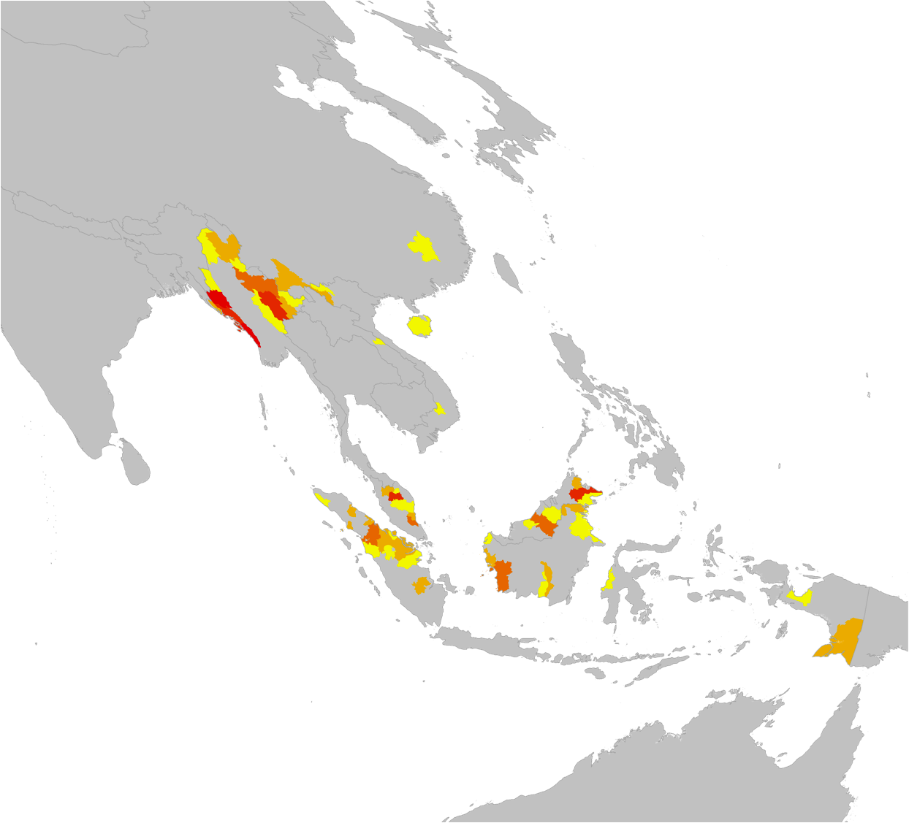

!SLIDE region-slide
.notes 2005

## Ranked intensity ##
# Hotspots among subprovinces #
### 2005 ###
<h2 style="position:absolute; top:562px; left:165px; color:#000000; font-size:15px">Top 5%</h2>
<h2 style="position:absolute; top:583px; left:165px; color:#000000; font-size:15px">Top 4%</h2>
<h2 style="position:absolute; top:604px; left:165px; color:#000000; font-size:15px">Top 3%</h2>
<h2 style="position:absolute; top:625px; left:165px; color:#000000; font-size:15px">Top 2%</h2>
<h2 style="position:absolute; top:646px; left:165px; color:#000000; font-size:15px">Top 1%</h2>

!SLIDE region-slide
.notes 2006

## Ranked intensity ##
# Hotspots among subprovinces #
### 2006 ###
<h2 style="position:absolute; top:562px; left:165px; color:#000000; font-size:15px">Top 5%</h2>
<h2 style="position:absolute; top:583px; left:165px; color:#000000; font-size:15px">Top 4%</h2>
<h2 style="position:absolute; top:604px; left:165px; color:#000000; font-size:15px">Top 3%</h2>
<h2 style="position:absolute; top:625px; left:165px; color:#000000; font-size:15px">Top 2%</h2>
<h2 style="position:absolute; top:646px; left:165px; color:#000000; font-size:15px">Top 1%</h2>

!SLIDE region-slide
.notes 2007

## Ranked intensity ##
# Hotspots among subprovinces #
### 2007 ###
<h2 style="position:absolute; top:562px; left:165px; color:#000000; font-size:15px">Top 5%</h2>
<h2 style="position:absolute; top:583px; left:165px; color:#000000; font-size:15px">Top 4%</h2>
<h2 style="position:absolute; top:604px; left:165px; color:#000000; font-size:15px">Top 3%</h2>
<h2 style="position:absolute; top:625px; left:165px; color:#000000; font-size:15px">Top 2%</h2>
<h2 style="position:absolute; top:646px; left:165px; color:#000000; font-size:15px">Top 1%</h2>

!SLIDE region-slide
.notes 2008

## Ranked intensity ##
# Hotspots among subprovinces #
### 2008 ###
<h2 style="position:absolute; top:562px; left:165px; color:#000000; font-size:15px">Top 5%</h2>
<h2 style="position:absolute; top:583px; left:165px; color:#000000; font-size:15px">Top 4%</h2>
<h2 style="position:absolute; top:604px; left:165px; color:#000000; font-size:15px">Top 3%</h2>
<h2 style="position:absolute; top:625px; left:165px; color:#000000; font-size:15px">Top 2%</h2>
<h2 style="position:absolute; top:646px; left:165px; color:#000000; font-size:15px">Top 1%</h2>

!SLIDE region-slide
.notes 2009

## Ranked intensity ##
# Hotspots among subprovinces #
### 2009 ###
<h2 style="position:absolute; top:562px; left:165px; color:#000000; font-size:15px">Top 5%</h2>
<h2 style="position:absolute; top:583px; left:165px; color:#000000; font-size:15px">Top 4%</h2>
<h2 style="position:absolute; top:604px; left:165px; color:#000000; font-size:15px">Top 3%</h2>
<h2 style="position:absolute; top:625px; left:165px; color:#000000; font-size:15px">Top 2%</h2>
<h2 style="position:absolute; top:646px; left:165px; color:#000000; font-size:15px">Top 1%</h2>

!SLIDE region-slide
.notes 2010

## Ranked intensity ##
# Hotspots among subprovinces #
### 2010 ###
<h2 style="position:absolute; top:562px; left:165px; color:#000000; font-size:15px">Top 5%</h2>
<h2 style="position:absolute; top:583px; left:165px; color:#000000; font-size:15px">Top 4%</h2>
<h2 style="position:absolute; top:604px; left:165px; color:#000000; font-size:15px">Top 3%</h2>
<h2 style="position:absolute; top:625px; left:165px; color:#000000; font-size:15px">Top 2%</h2>
<h2 style="position:absolute; top:646px; left:165px; color:#000000; font-size:15px">Top 1%</h2>

